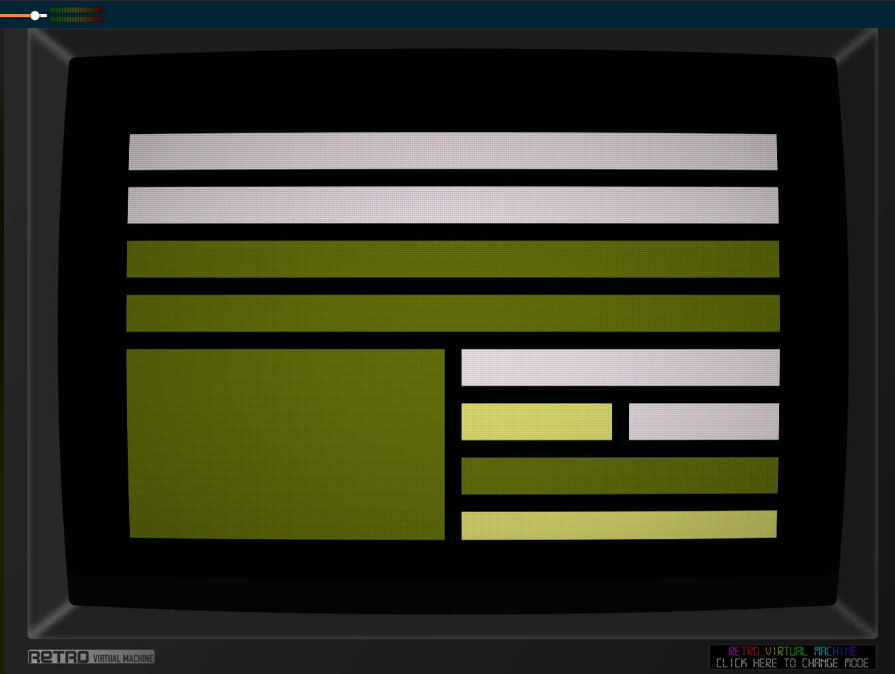

# symsav-deco

A recursive rectangle subdivision screensaver for [SymbOS](https://www.symbos.org/) on the Amstrad CPC and MSX.

> **Alpha version — use at your own risk.** This software is in an early alpha state and may cause harm to your system. If you choose to try it, you do so entirely at your own risk.

> **CPC requires Mode 1** — on the Amstrad CPC this screensaver only works in 320×200 Mode 1 (4 colours). Running it in any other screen mode will produce incorrect output.

Inspired by Jamie Zawinski's [deco](https://www.jwz.org/xscreensaver/) from the xscreensaver suite (concept originally by Michael D. Bayne).

---

## Platform support

A single `deco.sav` binary runs on both platforms. The platform is detected at runtime via `Sys_Type()`.

| Platform | Resolution | Colours |
|----------|-----------|---------|
| Amstrad CPC | 320×200 (Mode 1) | 3 fill inks (bright, white, dim) |
| MSX | 512×212 (Screen 7) | 8 fill colours (white, green, light green, light red, yellow, gray, cyan, blue) |

On MSX the larger screen and 16-colour palette produce denser, more colourful subdivisions.

---

## Building

```bash
./build.sh
```

Requires the SCC compiler (set `SCC=` env var if not at `../scc/bin/cc`) and Python 3.

Build steps:

1. SCC compiles `deco.c` + `deco_msx.s` → `deco.sav`
2. `add_preview.py` patches the preview thumbnail into the binary at file offset 256

Output: `deco.sav`

---

## Installing

1. Copy `deco.sav` into your `C:\SYMBOS\` directory.
2. Open **Display Properties** and go to the **Screen Saver** tab.
3. Click **Browse** and select `deco.sav`.
4. Click **Setup** to configure the effect:
   - **Depth**: Shallow / Normal / Deep — maximum recursion depth (8 / 12 / 16 levels)
   - **Split**: Random (50/50) or Golden (62/38 ratio, always splits the longer axis)
   - **Speed**: Slow / Normal / Fast — ticks between full redraws (300 / 150 / 60)

---

## Effect

- The full screen is recursively divided into axis-aligned rectangles
- Each leaf rectangle is filled with a randomly chosen colour; the black background shows through as a 4-pixel border between panels
- After the configured pause the screen clears and a new random subdivision is drawn
- Frames with fewer than 3 panels are discarded and replanned (up to 8 retries) so degenerate single-colour frames are never shown

The subdivision loop is implemented iteratively with an explicit work-stack (`stk_x/y/w/h/d[32]` in the data segment) to avoid relying on deep SCC call-stack recursion.

---

## Screensaver protocol

Standard SymbOS screensaver messages:

| Message | Action |
|---------|--------|
| `MSC_SAV_INIT` (1) | Load saved config from manager |
| `MSC_SAV_START` (2) | Start fullscreen animation |
| `MSC_SAV_CONFIG` (3) | Open config dialog |
| `MSR_SAV_CONFIG` (4) | Send updated config back |

Config is 7 bytes: magic `"DECO"` + depth byte + split byte + speed byte.

---

## Rendering

Fullscreen rendering follows the same approach as [symsav-xroach](https://github.com/salvogendut/symsav-xroach) and [symsav-xmatrix](https://github.com/salvogendut/symsav-xmatrix):

1. Open a fullscreen `WIN_NOTTASKBAR | WIN_NOTMOVEABLE` window
2. `DSK_SRV_DSKSTP` to freeze the desktop
3. Clear the screen
4. Per frame: decrement pause timer; when it expires, clear and redraw a new subdivision
5. Exit on any key or mouse movement: resume desktop, close window, `Screen_Redraw()`

### CPC (Mode 1, 320×200)

VRAM is interleaved across 8 planes. Fill formula for a byte-aligned rect at pixel column `x`, row `y`, byte-width `bw`:

```
addr = 0xC000 + (y/8)*80 + (y%8)*0x800 + x/4
Bank_Copy(addr, fill_buf, bw)   // repeated for each scanline
```

Screen clear: write 2000 bytes of `0xF0` (ink1 = black) to each of the 8 planes via `Bank_Copy`.

### MSX (Screen 7, 512×212)

VRAM is linear, written via VDP ports `0x98` (data) / `0x99` (address). Each byte holds 2 pixels as 4-bit nibbles; a solid fill byte is `(color << 4) | color`.

```
vram_addr = row * 256 + x/2
vdp_fill(vram_addr, fill_byte, w/2)   // repeated for each scanline
```

Screen clear: `vdp_fill(0, 0x11, 54272)` — a single 54272-byte write covering all 212 rows.
